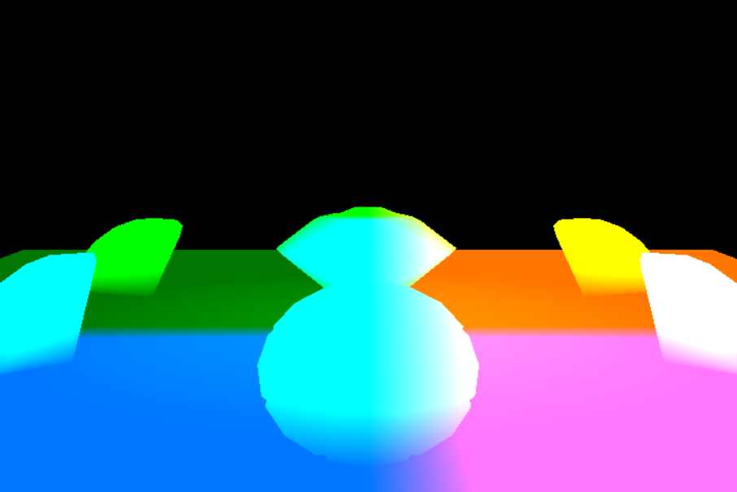
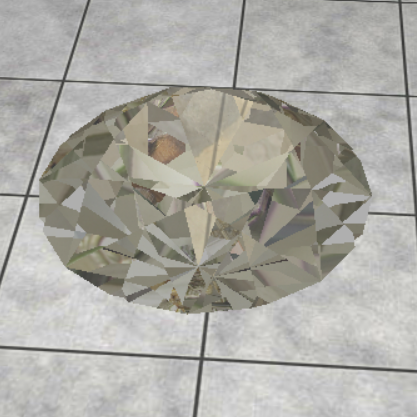
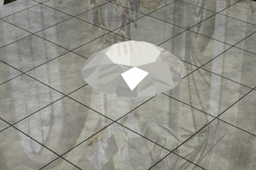
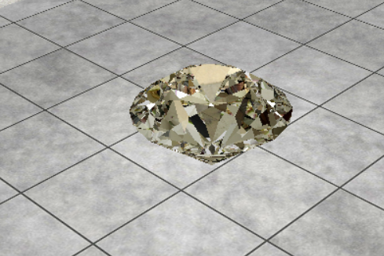
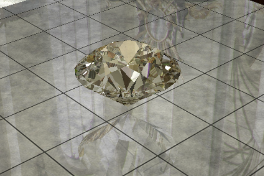
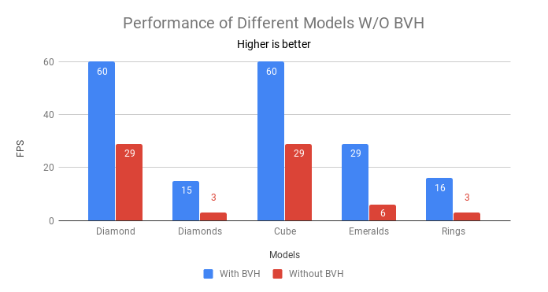

GPU Rasterized And Ray Traced Real Time Rendering Using WebGL
======================

**University of Pennsylvania, CIS 565: GPU Programming and Architecture, Final Project**

* Yuru Wang, Wanru Zhao
* Tested on: **Google Chrome 62.0.3202.94** on Windows 10, i7-7700HQ @ 2.5GHz 128GB, GTX 1050 Ti 8GB (personal computer) and **Google Chrome 71.0.3578.80** Windows 10, Intel(R) Core(TM) i7-8750H CPU@2.2GHz, GTX 1070 with Max-Q Design(Personal Laptop)

### Live Online
[Live Demo](https://wanruzhao.github.io/CIS565-Final-Project/)

### Demo Video/Gif

  

### Slides
[Slides](https://docs.google.com/presentation/d/1IV-hGhshcx--qwChoxhV8sUtsPJW2yRIfDSoRfvkCAE/edit?usp=sharing)

## Project Description ##
This project implements bybrid real time raytracing using WebGL. This project is originally inspired by Rigid Gems and referred to the hybrid rendering pipleline introduced in the presentation of SHINY PIXELS AND BEYOND: REAL-TIME RAYTRACING AT SEED.

A list of features implemented in this project is as follows:
* Rasterization and GBuffer: Stored the rasterized data (world position, normal, albedo color, material) in the gbuffer
* OBJ loading: loaded obj model with webgl-obj-loader
* Texture mapping: added texture to models, UV interpolation
* Ray traced reflection: ray traced specular reflection
* Ray traced refraction: used snell's law for ray's direction and include intenal reflection inside models based on critical angle.
* Ray traced soft/hard shadow
* Environment mapping
* Post processing (glow, DOF)
* Dispersion
* FXAA
* BVH and KDTree: constructed and flattened BVH tree on CPU, encode it in WebGL texture and traverse the tree on GPU

## Results ##

**Texture mapping**

**OBJ loading**

**Rasterization and GBuffer**

| Albedo | Material |
|------|------|
|  |  |

| Position | Normal |
|------|------|
|  |  |

We stored the rasterized data such as position, normal, albedo color, and material into gbuffers, and lauch the rays from the first intersection in the world based on the data in gbuffer.

**Ray traced reflection pass**

| Ray depth = 2 | Ray Depth = 4 |
|------|------|
|  |  |

We raytraced the specular reflection and above diamond has material of 0.5 diffuse/ 0.5 specular. With different ray depth, we can notice the difference of the reflection of the diamond on the floor.

**Ray traced refraction pass**

| Ray depth = 2 | Ray Depth = 5 | Ray depth = 10 | Ray Depth = 20 |
|------|------|------|------|
|  |  |  |  |

We used Snell's law to calculate the direction of refract ray, and added internal reflection inside the model to create more diamond like look.

**Combine separate Passes**

| Direct Lighting | Ray Traced Refelection | Ray Traced Refraction | Combined |
|------|------|------|------|
|  |  |  |  |

The reflection, refraction and direct lighting are done in seperate passes. We blend the output of thoses passes based on the material of the object.

**BVH and KDTree**

Since our models are all meshes, performance drops heavily when using high poly meshes. We used BVH(Bounding box hierachy) and KD Tree to accelerate the intersection checking between ray and triangles. The KD tree is constructed and flattened on CPU, encoded in WebGL textures, and traversed on GPU. Above image is the BVH texture used in shader.

## Performance Analysis ##
  

We can observe about more than two folds of performance improvement with BVH. We didn't observe much performance difference when we adjust the maximum number of primitives stored in each leaf node, this is probably because even though allowing more triangles in leaf nodes results in shorter tree height and shorter traverse time, more time will be consumed on checking more triangles in each leaf node. So there is a tradeoff.

### Credits and Reference
* SHINY PIXELS AND BEYOND: REAL-TIME RAYTRACING AT SEED: https://www.ea.com/seed/news/seed-gdc-2018-presentation-slides-shiny-pixels
* RigidGems: http://www.rigidgems.sakura.ne.jp/index_en.html

